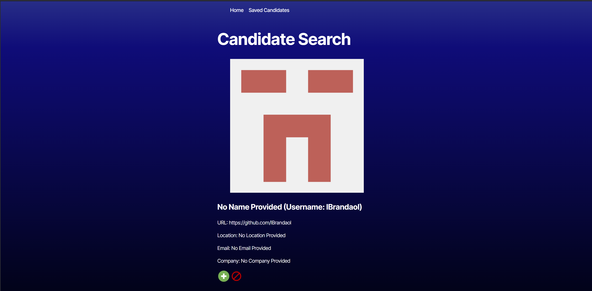
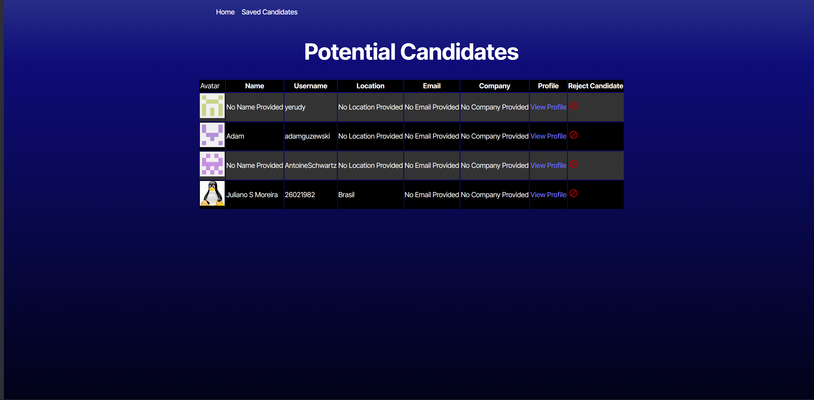

# Candidate Selector  
## Description

This project is simply a random selector for candidates using React for the front end. The idea was simply to get better at React and how it interacts with typescript and how to get it to "play nice" with an API. The real world problem it could solve is that it allows an easy way for someone to search for candidates for positions.

## Installation

No Installation required if you want to run the "production version" which is linked under the usage section. If, however, you'd like to run the local version, clone the repository and then type ```npm start```

## Usage

The application is divided into two sections:

### Home page 

This will pull a list of 30 candidates for you to review. At the end of that 30 candidates, you can either refresh to pull a different, random 30 or you can review those that you have saved by choosing "Saved Candidates"

### Saved Candidates

This will allow the user to review the candidates that they have selected. In a real-world sense, this would allow the user to narrow down further profiles. (They can be opened in a separate tab and cull the list further.)

## Credits

N/A

## License

No License Provided
